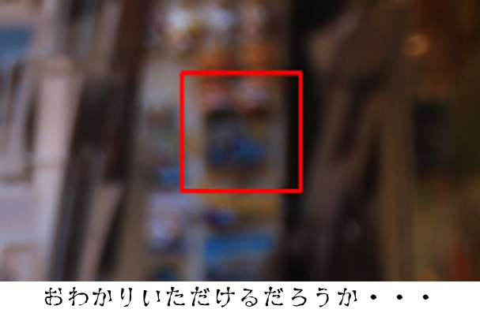

# はじめてのAI体験

機械学習を始める前に、まず人工知能を使ってみないことには何も始まらない、と思いました。

最近では、Googleなどが画像を投げるだけで物体検出してくれるようなアプリケーションを提供しています。
しかし、それではあまり体験しているような感覚がないので、ローカルマシンで動くものを試してみます。
やはりAIといえば、圧倒的に有名な **OpenCV** がまず頭に浮かびました。

## OpenCVで顔検出してみる

OpenCVといえば、顔検出が有名です。
とりあえず適当に手持ちのコスプレ写真を探し、顔検出を試みます。
Rubyでやりたかったんですが、公式ドキュメントを見てもpythonなので仕方なくpythonでやりました。
チュートリアル通り実装し、実行してみたところ、4人中2人の顔が検出できました。
また、顔でない部分を誤検知することも多々あり、いろいろパラメータを変化させてみてもそれほどうまく検出できませんでした。
調べてみると、OpenCVは **傾いた顔** の検出がとても苦手だと言う話でした。

次に、ソースコード内で `haarcascade_frontalface_default.xml` という謎のファイルを指定している部分に注目しました。
このファイルの中身を確認してみましたが、全く意味不明な数字が羅列されたxmlファイルでした。
同じディレクトリにたくさんファイルがあり、 その中には `haarcascade_frontalface_alt2.xml` のような `alt2` って一体なんだよと思うようなファイルもありましたが、その中でひときわ目立つ `haarcascade_frontalcatface.xml` という素晴らしみが溢れるファイルを発見します。

## 猫の顔を検出してみる

  

明らかに猫の顔を検出しそうなこのファイルを使い、[ヴェネツィアで撮った猫の写真](https://raw.githubusercontent.com/np-complete/c94/master/images/cat.jpg)で試してみたところ、見事に猫の顔が検出されました。

さらに、何を思ったのか同じ画像を元の人間用の `haarcascade_frontalface_default.xml` で検出してみたところ、猫の顔は検出されず、右上の空間に反応がありました。
こんなところで反応するなんておかしいな〜。壊れてるのかな〜。嫌だな〜。怖いな〜。と思って見てみるとですね、いるんですよ・・・。
凄い形相でギィィィーーーッと、こっちを睨んでる。
気づいた瞬間ギャッと叫んで「ナンマンダブ、ナンマンダブ」と唱えながら `scaleFactor` の値を大きくして再実行してみたらすーーーっと消えたんですね。
一体何だったのか、今となってはわかりませんが恐ろしい体験でした。

この体験により初めてAIおっもしれえなという感覚が分かり、
とりあえずAI使ってみるという目標は達成したので、
次は実際に機械学習やってみようという段階に移ります。

## まとめ

あんなに有名なOpenCVが全然性能が良くないというのが驚きでした。
GoogleのWebアプリケーション、普通にローカルマシンで動かしたいと切実に思いました。
